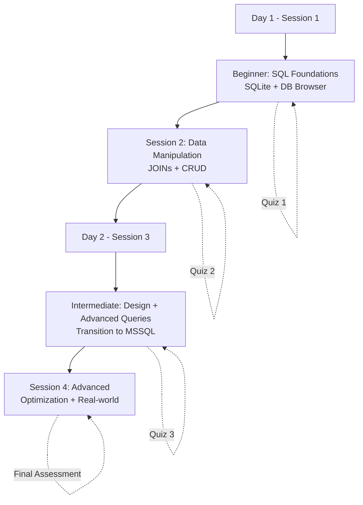

# SQL/MSSQL Training Program - 2-Day Bootcamp Design

## Overview
Designed a comprehensive 2-day SQL training bootcamp for mixed-skill participants (< 10 people). Program covers beginner to advanced topics across 4 sessions (8 hours instruction + 2 hours breaks/quizzes). Training flow: SQLite for fundamentals → MSSQL for advanced features. Each session ends with practical assessment.

**Target Outcomes**: Participants will write queries, design databases, optimize performance, and apply SQL to real-world scenarios.

## Training Architecture

## Session Breakdown

| Session | Level | Duration | Tool | Focus Areas |
|---------|-------|----------|------|-------------|
| 1 | Beginner | 2.5hrs | SQLite | SELECT, WHERE, Basic Aggregates |
| 2 | Beg/Int | 2.5hrs | SQLite | GROUP BY, JOINs, INSERT/UPDATE/DELETE |
| 3 | Intermediate | 2.5hrs | MSSQL | DB Design, Advanced JOINs, CTEs |
| 4 | Advanced | 2.5hrs | MSSQL | Optimization, Indexes, Window Functions |

## Key Pedagogical Decisions

### **Decision**: Progressive Tool Transition (SQLite → MSSQL)
**Rationale**: 
- SQLite's DB Browser provides zero-friction setup for fundamentals
- Reduces cognitive load Day 1 (no server config, simpler syntax)
- MSSQL introduction Day 2 when foundational concepts solid
**Impact**: Smoother learning curve, less setup troubleshooting
**Timing**: Transition happens Session 3 start (40min buffer for setup)

### **Decision**: Same Group Progression (All 3 Levels)
**Rationale**: 
- Mixed-skill audience requires adaptive pacing
- Scaffolded learning builds from basics to advanced
- Review opportunities for beginners, fast-track sections for experienced
**Impact**: Need breakout exercises with varying difficulty
**Implementation**: Core content + "Challenge" exercises for advanced learners

### **Decision**: Real-World Use Cases Throughout
**Rationale**: 
- Adult learners need immediate relevance ("Why does this matter?")
- Concrete examples (Netflix, e-commerce) improve retention
- Capstone project Session 4 ties everything together
**Impact**: Higher engagement, practical application focus
**Examples**: 
- Session 1: "How Netflix tracks what you watched"
- Session 4: "You're an e-commerce analyst" scenario

### **Decision**: Quiz After Each Session (4 Total)
**Rationale**: 
- Spaced retrieval strengthens memory
- Identifies knowledge gaps immediately
- Provides concrete checkpoints
**Format**: 60% practical (write queries) + 40% conceptual
**Duration**: 10-15min per quiz with immediate review

## Session Details

### **Day 1**

#### Session 1: SQL Foundations (2.5hrs)
- **Real-world hook**: Database concepts through familiar apps
- **Core skills**: SELECT, WHERE, ORDER BY, LIMIT, basic aggregates
- **Hands-on**: Customer orders database exercises
- **Tools**: DB Browser for SQLite + sample Northwind DB

#### Session 2: Working with Data (2.5hrs)
- **Core skills**: GROUP BY + HAVING, INNER/LEFT JOIN, CRUD operations, string/date functions
- **Hands-on**: Multi-table customer-order relationships
- **Key concept**: Normalization introduction (why multiple tables?)

### **Day 2**

#### Session 3: Database Design & Advanced Queries (2.5hrs)
- **MSSQL transition**: Install SQL Server Express/Azure Data Studio
- **Core skills**: Normalization (1NF-3NF simplified), PK/FK design, advanced JOINs, subqueries, CTEs
- **Hands-on**: Design library system, multi-table queries
- **Exercise**: "Design tables for [real scenario]"

#### Session 4: Optimization & Real-World (2.5hrs)
- **Core skills**: Execution plans, indexes, views, stored procedures, window functions
- **Capstone**: E-commerce analyst scenario
  - Find top products
  - Calculate retention rate
  - Build monthly sales report
  - Optimize slow query
- **Outcome**: Full workflow from question → optimized solution

## Learning Progression

## Materials & Resources

**Sample Databases**:
- Day 1: Northwind (SQLite) - retail/sales data
- Day 2: AdventureWorks LT (MSSQL) - enterprise scenarios

**Deliverables to Prepare**:
- SQL syntax cheat sheet (handout)
- 4 quiz sets (practical + conceptual)
- Sample databases with realistic data
- Exercise workbooks with solutions
- Resource list for continued learning

**Exercise Structure**: Demo → Guided Practice → Independent Practice

## Real-World Use Cases Integrated

| Domain | Example | Session(s) |
|--------|---------|-----------|
| E-commerce | Order tracking, inventory, top products | 1, 2, 4 |
| Streaming | User watch history, recommendations | 1 |
| HR | Employee hierarchies, payroll reports | 3 |
| Analytics | Customer retention, sales trends | 4 |
| Financial | Transaction reports, reconciliation | 2, 3 |

## Lessons Learned (Training Design Principles)

1. **Tool selection matters**: SQLite removes barriers Day 1; MSSQL adds production relevance Day 2
2. **Progressive complexity**: Don't jump to JOINs before mastering SELECT
3. **Mixed audiences**: Provide "challenge" problems for advanced learners during labs
4. **Assessment frequency**: Quiz per session keeps engagement high, identifies gaps early
5. **Relevance first**: Lead with "why" (real scenarios) before "how" (syntax)
6. **Hands-on ratio**: 60-70% practical exercises, 30-40% lecture/demo
7. **Small groups (<10)**: Enables personalized troubleshooting, deeper Q&A

## Potential Challenges & Mitigations

| Challenge | Mitigation |
|-----------|-----------|
| Setup issues (MSSQL Day 2) | Pre-install checklist, cloud sandbox backup |
| Skill gap in mixed group | Tiered exercises (core + challenge), peer pairing |
| Pacing too fast/slow | Built-in flex time (±15min per session) |
| Query errors frustration | Debugging as teaching moment, common errors list |
| Retention after training | Post-training practice problems, resource guide |

## Success Metrics

**By End of Training, Participants Can**:
- ✅ Write SELECT queries with filters, sorts, aggregates
- ✅ Join 3+ tables to answer business questions
- ✅ Design normalized database schemas
- ✅ Explain and use indexes for optimization
- ✅ Apply SQL to real-world analyst/developer tasks
- ✅ Read execution plans and identify bottlenecks

**Quiz Performance Targets**:
- Sessions 1-2: 70%+ average (fundamentals)
- Sessions 3-4: 65%+ average (advanced concepts)

## Next Steps

1. **Prepare materials** (databases, exercises, quizzes)
2. **Test run** timing with sample audience
3. **Refine** based on pilot feedback
4. **Create** post-training support channel (Slack/email)
5. **Follow-up** survey 2 weeks post-training (retention check)

## Timeline

```mermaid
gantt
    title 2-Day SQL Bootcamp Schedule
    dateFormat HH:mm
    axisFormat %H:%M
    
    section Day 1
    Session 1 Beginner      :09:00, 150m
    Break                   :11:30, 40m
    Session 2 Beg/Int       :12:10, 150m
    
    section Day 2
    Session 3 Intermediate  :09:00, 150m
    Break                   :11:30, 40m
    Session 4 Advanced      :12:10, 150m
```

---

**Summary**: Comprehensive 2-day SQL bootcamp balances theory and practice, uses progressive tooling (SQLite→MSSQL), integrates real-world scenarios, and scaffolds from basic queries to production optimization. Mixed-skill approach with tiered exercises ensures all participants progress regardless of starting level.